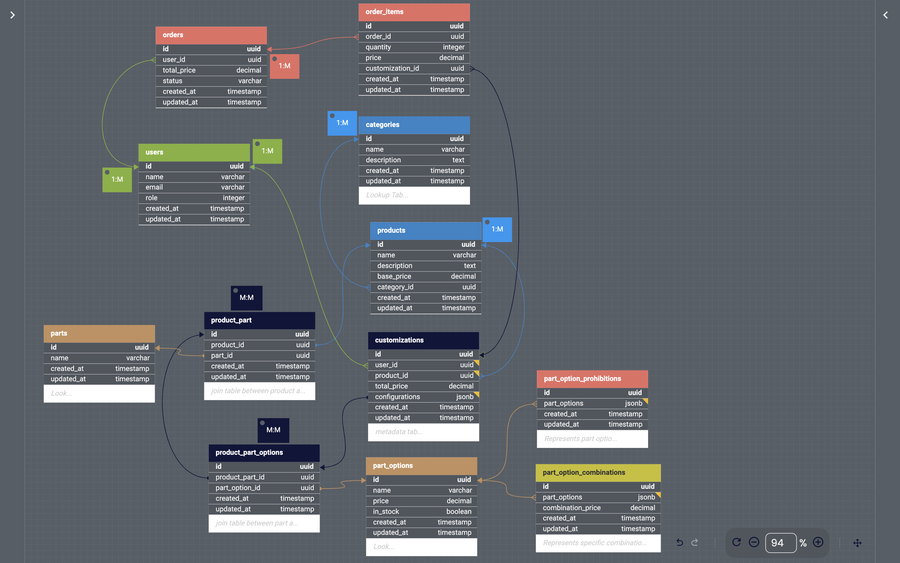

# Entity Modeling

[Back to Main Page](README.md) | [Next: Database Specifications](schema.md) |

### ERD

## Model Associations

### User
The *User* model has has_many *:orders* and has_many *:customizations*, which I used for tracking user activity.

### Order and OrderItem
The *Order* model belongs to User and has many *OrderItems*. The OrderItem model, in turn, belongs to Order and Customization, establishing the relationship between the order and the specific customization a user has made.

### Category and Product
The *Category* model has many *Products*, and *Product* belongs to *Category*.
The Product model’s relationship with *Part* through *ProductPart* gives me a flexible association between products and their parts.

### Part and PartOption
The *Part* model belongs to *Product* and has many *PartOptions* through *ProductPartOptions*. This setup allows me to associate parts with specific products and their respective options, which is appropriate for business use case.

### ProductPart and ProductPartOption
These models many-to-many relationships between Product and Part, and between Part and PartOption. I believe it is essential for the flexible configuration of product parts and options.

### Customization
The *Customization* model belongs to both *User* and *Product*, with has_many *:order_items*. This structure will be used for tracking customizations and linking them to orders.

### PartOptionCombination and PartOptionProhibition
These models are present but currently without associations. For now, they serve as standalone models for storing JSONB fields related to combinations and prohibitions.

[Back to Main Page](README.md) | [Next: Database Specifications](schema.md) |