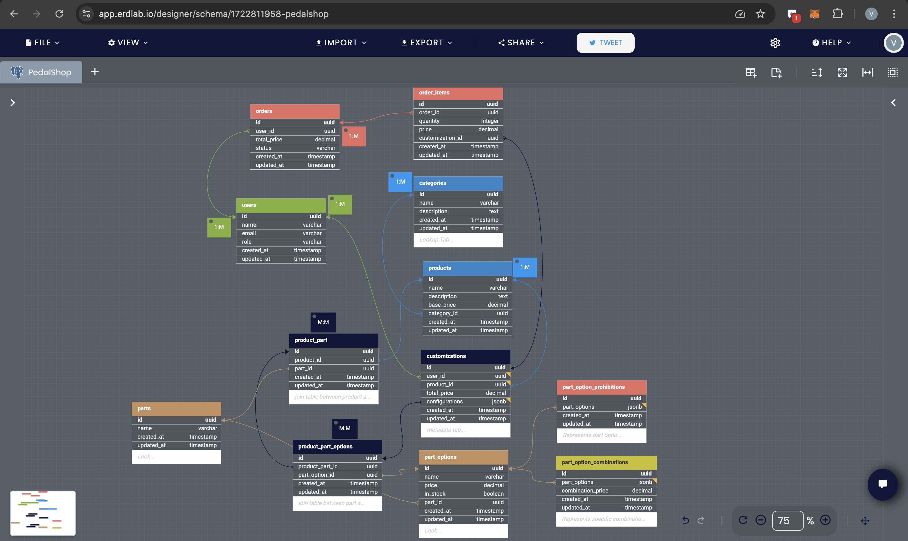

# Entity Modeling

[Back to Main Page](README.md) | [Next: Database Specifications](schema.md) |

### ERD

## Model Associations

#### User
The *User* model has has_many *:orders* and has_many *:customizations*, which I used for tracking user activity.

#### Order and OrderItem
The *Order* model belongs to User and has many *OrderItems*. The OrderItem model, in turn, belongs to Order and Customization, establishing the relationship between the order and the specific customization a user has made.

#### Category and Product
The *Category* model has many *Products*, and *Product* belongs to *Category*.

#### Part and PartOption
A *Part* model and has many *PartOptions*. This is a direct setup to handle option choices for each part. Parts and PartOptions are managed independently and remain flexible across the entire system which helps me to use it for all kinds of products like skis, surfboards.

#### ProductPart and ProductPartOption
Models a many-to-many relationships between Product and Part, and between Part and PartOption. I believe it is essential for the flexible configuration of product parts and options. For example, admin could define specific configurations of a product, like a _Mountain Bicycle_ or _Road Bicycle_, each with different parts and part options.

#### Customization
The *Customization* model belongs to both *User* and *Product*, with has_many *:order_items*. This structure will be used for tracking customizations and linking them to orders.

#### PartOptionCombination and PartOptionProhibition
These models are present but currently without associations. For now, they serve as standalone models for storing JSONB fields related to combinations and prohibitions. Assumption is general prohibitions on any product and not product-specific prohibitions.

## Model Description

### Order
- Purpose: Represents a customer's order.
- Fields:
    - Refer to: [Table Orders](schema.md#table-orders)
- Association
    - Belongs to a User
    - Has many OrderItems
- Example
    - A user can place an order that contains multiple items

### OrderItems
- Purpose: Represents items in an order
    - Traceability: This is crucial for auditing, customer support, and analyzing user preferences.
    - Consistency: It ensures that the specific configuration used to create each OrderItem is preserved.
    - Reproducibility: allows to reproduce the exact product configuration in case of returns, disputes, or if the customer wants to reorder the same configuration.
    - Simplified Queries: easier to query and generate reports based on specific customizations, such as how popular certain customizations are, or which customizations lead to more completed orders.
- Fields
    - Refer to: [Table OrderItems](schema.md#table-orderitems)
- Association
    - Belongs to Order
    - Belongs to Customization

### User (can be admin, or buyer)
- Purpose: Represents the user in the system (admin or buyer)
- Fields
    - Refer to: [Table User](schema.md#table-users)
- Associations
    - Has many Orders
    - Has many Customizations

### Category
- Purpose: Represents a category of products (e.g., bicycles, skis, surfboards).
- Fields:
    - Refer to: [Table Category](schema.md#table-categories)
- Association
    - Has many Products
- Example
    - Bicycle
    - Skis
    - Surfboards

### Product
- Purpose: Represents the main product being sold.
- Fields:
    - Refer to: [Table Products](schema.md#table-products)
- Association
    - Belongs to Category
    - Has many Parts through ProductParts
    - Has many Customizations
- Examples
    - A mountain wheel bicycle

### Part
- Purpose: Represents different parts of a product (e.g., frame type, wheels, rim color, chain, frame finish).
- Fields:
    - Refer to: [Table Parts](schema.md#table-parts)
- Association
    - Has many PartOptions
    - Has many Products, through ProductParts
- Example
    - Frame type
    - Frame Finish
    - Wheels
    - Rim Color
    - Chain

### PartOptions
- Purpose: Represents option choices for a part
- Fields
    - Refer to: [Table PartOptions](schema.md#table-partoptions)
- Association
    - Belongs To Part
    - Has many ProductParts through, ProductPartOptions
- Examples
    - Part: Frame Type
        - Options - Full-suspension || diamond || step-through
    - Part: Frame Finish
        - Options - Matte || shiny
    - Part: Wheel
        - Options - Road wheels || mountain wheels || fat bike wheels
    - Part: Rim Color
        - Options - Red || Black || blue
    - Part: Chain
        - Options - Single-speed chain || 8-speed chain

### PartOptionCombinations
- Purpose: Represents specific combinations of part options that have a unique price. Typically, there would be a main part option which will be influenced by other options (single or multiple)
- Fields
    - Refer to: [Table PartOptionCombination](schema.md#table-partoptioncombinations)
- Association
    - N/A
- Example
    - matte finish over a full-suspension frame, price: 50 EUR, 
    - matte finish over a diamond frame, price: 35 EUR.

### PartOptionProhibition
- Purpose: Represents prohibited combinations of part options, ensuring that invalid combinations are not allowed. Typically, we can define a part option alongside options that can not be combined with it.
- Fields
    - Refer to: [Table PartOptionProhibition](schema.md#table-partoptionprohibitions)
- Association
    - N/A
- Examples
    - Mountain wheels cannot be combined with diamond frame type
    - Mountain wheels cannot be combined with step through frame type

### Customization (metadata table)
- Purpose: metadata table that captures the exact combination of parts and part options selected by a buyer for a particular product.
    - It allows us to store the specific choices each buyer makes for their bicycle. 
    - It stores the total price of the customized product, which is calculated based on the individual prices of the selected parts and any combination-specific pricing rules.
    - We can use this metadata to evaluate completed orders
    - Allows for flexibility in handling different products and their unique parts and options.
- Fields
    - Refer to: [Table Customization](schema.md#table-customizations)
- Association
    - Belongs to a User
    - Belongs to a Product
    - Has many OrderItems

### ProductPart
- Purpose: associates a Product with its corresponding Part. This allows to have Product with custom parts
- Fields
    - Refer to: [Table ProductPart](schema.md#table-productparts-join-table)
- Association
    - Belongs to Product
    - Belongs to Part
    - Has many ProductPartOptions

### ProductPartOptions
- Purpose: associates a Part with its specific PartOptions within the context of a particular Product.
- Fields
    - Refer to: [Table ProductPartOption](schema.md#table-productpartoptions-join-table)
- Association
    - Belongs to ProductPart
    - Belongs to PartOption

[Back to Main Page](README.md) | [Next: Database Specifications](schema.md) |